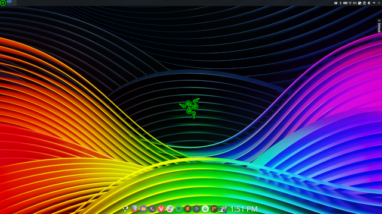
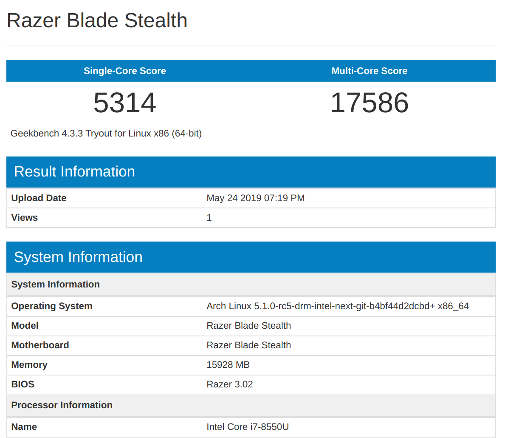

# archlinuxrazerblade

pacman -S xf86-input-evdev tlp xf86-video-intel intel-compute-runtime intel-ucode
xf86-input-libinput vulkan-intel 

GRUB_CMDLINE_LINUX_DEFAULT="quiet nvme_core.default_ps_max_latency_us=5500 button.lid_init_state=open"

