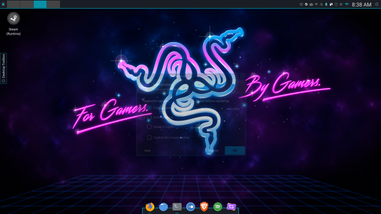

# archlinuxrazerblade

razer:

	## Must have headers installed
  	$ yay -S python-notify2
	$ yay -S openrazer-meta
	$ yay -S polychromatic
	$ sudo gpasswd -a $USER plugdev
	$ systemctl --user enable --now openrazer-daemon.service
	Reboot

sddm:

	$ sudo nano /usr/lib/sddm/sddm.conf.d/default.conf
	EnableHiDPI=true
	ServerArguments=-nolisten tcp -dpi 192

/etc/sysctl.d/net-tuning.conf from BlackArch

/etc/issue:

	--==[ BlackArch ]==-- \r (\l)

Set Plasma display scale x 2.

Font Settings:

	AntiAliasing: Enabled
	SubPixelRendering: RGB
	Hinting: Full
	ForceDPI: 192

Plasma theming:

	Neon Knights Blue https://store.kde.org/p/1320469/
	Tela Dark Icons https://github.com/vinceliuice/Tela-icon-theme
	Wallpaper https://assets.razerzone.com/eedownloads/desktop-wallpapers/Vice-City-3200x1800.png

zsh setup:

	$ sudo pacman -S zsh zsh-theme-powerlevel9k
	$ yay -S oh-my-zsh-git
	$ cp -ar /usr/share/oh-my-zsh ~/.oh-my-zsh
	$ cp -ar /usr/share/zsh-theme-powerlevel9k ~/.oh-my-zsh/themes/powerlevel9k 
	$ git clone https://github.com/powerline/fonts.git --depth=1
	$ cd fonts
	$ ./install.sh
	$ cd ~/.local/share/fonts
	$ mkfontdir
	$ fc-cache -fv ~/.local/share/fonts
	$ xset +fp ~/.local/share/fonts

RazerFont:

	$ cp RazerBlackwidow-Regular.ttf ~/.local/share/fonts/
	$ fc-cache -fv ~/.local/share/fonts

UHD 620 Graphics fix for slowness in kde:

	/etc/modprobe.d/i915.conf
	options i915 enable_guc=3
	options i915 fastboot=1
	options i915 enable_psr=1
	options i915 enable_fbc=1

	/etc/X11/xorg.conf.d/intel.conf
	Section "Device"
        Identifier      "Intel Graphics"
        Driver          "intel"
        Option          "AccelMethod" "sna"
        Option          "TearFree" "true"
        Option          "DRI" "3"
	EndSection

Better Touchpad:

	Install libinput-touchpad from AUR
	cp 30-touchpad.conf to /etc/X11/xorg.conf.d
	edit 30-touchpad.conf in etc:
		Option "AccelSpeed" "1.5"

Links:

https://mikepalmer.net/razer-blade-stealth-libinput-touchpad-issues/

https://github.com/arwkin/edpanel-grub2-theme

https://github.com/bhilburn/powerlevel9k

https://arcolinux.info

https://archlabslinux.com

https://www.google.com

http://terminal.sexy

https://www.razer.com/downloads

https://wiki.archlinux.org/index.php/HiDPI
