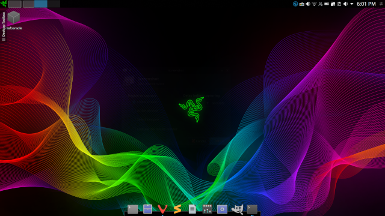
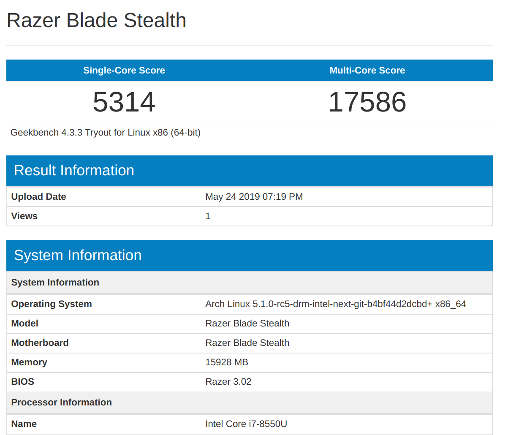

# archlinuxrazerblade

razer:

  	$ yay -S python-notify2
	$ yay -S openrazer-meta polychromatic
	$ sudo gpasswd -a $USER plugdev
	$ systemctl --user enable --now openrazer-daemon.service  

sddm:

	$ sudo nano /usr/lib/sddm/sddm.conf.d/default.conf
	EnableHiDPI=true

/etc/sysctl.d/net-tuning.conf from BlackArch

/etc/issue:

	--==[ BlackArch ]==-- \r (\l)

Set Plasma display scale x 2.  Other QT Scaling in .xprofile

PACMAN - tlp zsh latte-dock zsh-theme-powerlevel9k zsh-autosuggestions x86-input-evdev x86-video-intel intel-compute-runtime vulkan-intel plasma plasma-meta pigz smb4k

AUR - slimbookbattery networkmanager-dmenu-git breeze-blurred-git newaita-icons-git python-powerline-git oh-my-zsh-git arch-animated-startscreen

KDE - deepin dark 2 theme

Firejail setup: https://blog.layer5services.com

zsh setup:

	$ cp -ar /usr/share/oh-my-zsh ~/.oh-my-zsh
	$ cp -ar /usr/share/zsh-theme-powerlevel9k ~/.oh-my-zsh/themes/powerlevel9k 
	$ git clone https://github.com/powerline/fonts.git --depth=1
	$ cd fonts
	$ ./install.sh
	$ fc-cahce -fv ~/.local/share/fonts

RazerFont:

	$ cp RazerBlackwidow-Regular.ttf ~/.local/share/fonts/
	$ fc-cache -fv ~/.local/share/fonts

Benchmark link https://browser.geekbench.com/v4/cpu/13253832

Links:

https://github.com/arwkin/edpanel-grub2-theme

https://www.dennogumi.org/2014/04/unlocking-kwallet-with-pam/

https://github.com/bhilburn/powerlevel9k

https://arcolinux.info

https://archlabslinux.com

https://www.google.com

http://terminal.sexy

https://www.razer.com/downloads

https://wiki.archlinux.org/index.php/HiDPI
